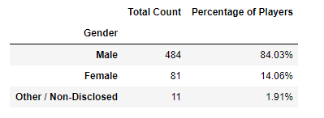

# Pandas_Challenge
This project analyses data of a fantasy game Heroes of Pymoli. Like many others in its genre, the game is free-to-play, but players are encouraged to purchase optional items that enhance their playing experience. With the help of the analysis, several patterns can be drawn to understand the market and sell the product better.

## Tools and Technologies used and required to run the project
* Python 3-Pandas
* Jupyter Notebook

## How to run the code
1. Download the folder HeroesOfPymoli
2. Open jupyter notebook and open HeroesOfPymoli.ipynb file
3. Run all cells

## Output
* Basic Understanding

* Gender Analysis

* Age Based Analysis

* Most Popular Item

* Most Profitable Item

* Top Spenders

* **Observable Trends:-**
1. There are approx 84pct of males as compared to 14 pct of female players.
2. Nearly 45 pct of the players are between the age group 20-24
3. "Oathbreaker, Last Hope of the Breaking Storm" is the most purchased product
